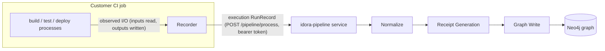
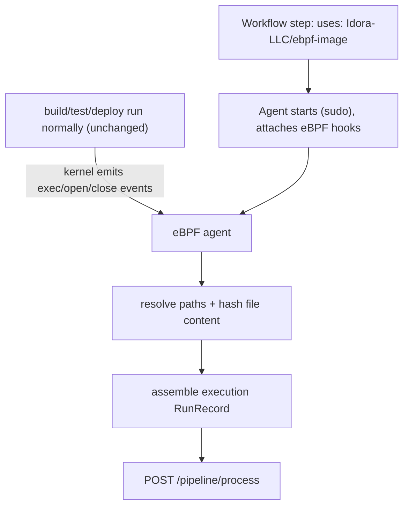
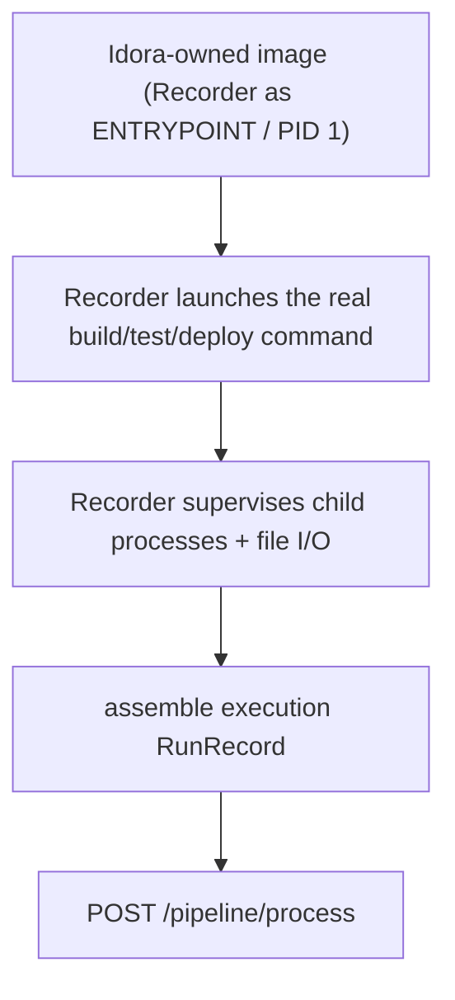
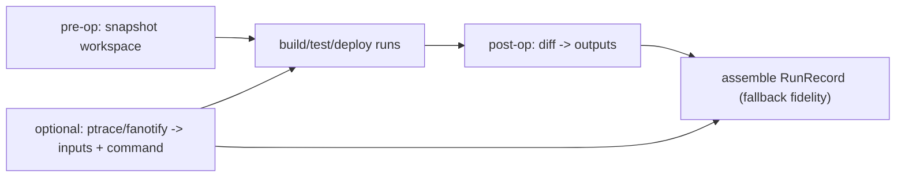

## 1. Intro

This document proposes and compares approaches for the Idora **Recorder**: the in-CI component that captures the I/O of `build`/`test`/`deploy` operations and emits execution RunRecords. It is a proposal and tradeoff analyzer, not a full specification, and deliberately does not commit to a single design.

## 2. What is the Recorder

The Recorder is the in-CI observer that watches `build`/`test`/`deploy` operations, captures their **inputs** (files read) and **outputs** (files created or modified) with content hashes, assembles an **execution RunRecord**, and submits it to the idora-pipeline service.

It is the **only Idora component that must live inside the customer’s CI**. The rest of the chain (Normalize → Receipt Generation → Graph Write) already moved out of CI into the idora-pipeline service, so the Recorder’s sole job is observation and submission.

### What it must produce (high level)

The Recorder emits **one execution RunRecord per operation**, conforming to the `RunRecordBase` shape the pipeline already accepts (run-record.ts). Every field below is part of the contract; the table states what the Recorder must capture and how the pipeline later treats it.

| Field | Type | What the Recorder must capture | Notes / pipeline handling |
| --- | --- | --- | --- |
| `type` | `"build" | "test" | "deploy"` | Which operation this record describes. | Drives which graph writer runs (the execution writer for these three). |
| `command` | `string` | The command line as observed (e.g. `npm run build`). | Part of the canonical record → contributes to the receipt hash. |
| `exit_code` | `number \| null` | The operation’s process exit status. | Must be present; `null` is allowed and preserved end-to-end (never defaulted to `0`). |
| `inputs` | `[{ path, hash }] \| null` | Every file the operation **read**. | Each becomes an `Artifact` (by hash) and a `File` (by path) node; edges `Receipt-[:CONSUMED]->Artifact`, `Receipt-[:CONSUMED]->File`, `File-[:IN_REPO]->Repo`. |
| `outputs` | `[{ path, hash }] \| null` | Every file the operation **created or modified**. | Each becomes an `Artifact` node only (no `File` node) with `Receipt-[:PRODUCED]->Artifact`. |
| `repo` | `string` | Repository identifier. | Becomes/MERGEs the `Repo` node; the receipt is linked `IN_REPO`. |
| `commit` | `string` | Git SHA being built/tested/deployed. | Part of the canonical record. |
| `platform` | `string` | OS, e.g. `linux`. | Part of the canonical record. |
| `architecture` | `string` | CPU arch, e.g. `amd64` / `arm64`. | Part of the canonical record. |
| `working_directory` | `string` | Absolute path the operation ran in. | Used by the pipeline as the **relativization root** for `inputs`/`outputs` paths, then itself part of the record. |
| `environment` | `object \| null` | Relevant environment variables. | The pipeline **filters** this (see below); the Recorder should avoid capturing obvious secrets in the first place. |
| `tool_versions` | `object \| null` | Map of tool → version (e.g. `{ "node": "20.x" }`). | Optional; may be `null`. |
| `timestamps` | `{ start_time, end_time, duration_ms }` | Operation start/end and duration. | **Stripped during normalization** so it never affects the receipt ID; operational timing is carried via the metadata sidecar instead. |

### Hashes

Both `inputs[].hash` and `outputs[].hash` are **`sha256:<64 lowercase hex>`** digests of the file’s **content** (the `ReceiptID` format). This is the part of the contract the current PoC does not yet satisfy — it captures paths but not content hashes — and it must be computed **while the workspace still exists**, because the hash cannot be recovered after the CI job tears down.

### Optional metadata sidecar

Alongside `runRecord`, the request may include a `metadata` object that is **not** part of the hashed record but is stored on the `Receipt` node. For execution records this is `ExecutionMetadataSidecar`:

- `start_time`, `end_time`, `duration_ms` — operational timing (the home for timing once it is stripped from the hashed record).
- `observation_mode` — `"snapshot"` or `"file_access_tracking"` — declares the fidelity with which the I/O was captured (this maps directly to the approaches in Section 4: full I/O tracing vs. before/after snapshotting).

### Submission

The record is sent as `POST /pipeline/process` with body `{ runRecord, metadata? }`, header `Authorization: Bearer <token>`, and an optional `X-Trace-Id`. The pipeline then:

1. **Normalizes** — validates required/variant fields, **removes `timestamps`**, **relativizes** `inputs`/`outputs` paths against `working_directory` (e.g. `/work/repo/src/a.ts` → `src/a.ts`), and **filters `environment`** to drop volatile/secret keys (`GITHUB_RUN_ID`, `GITHUB_TOKEN`, `ACTIONS_*`, `RUNNER_TEMP`, `HOME`, `TMPDIR`, …), then emits RFC 8785 canonical JSON.
2. **Hashes** the canonical record into a `sha256:` **receipt ID** (content-addressed, so identical operations produce identical receipts and replays are idempotent).
3. **Writes the graph** — MERGEs the `Receipt`, `Repo`, `Artifact`, and `File` nodes plus the `CONSUMED` / `PRODUCED` / `IN_REPO` edges described in the table above.

Two consequences for the Recorder: timing and runner-specific env values are deliberately **not** identity-bearing (so it is safe to capture them for the sidecar), and path relativization means the Recorder should report real absolute paths and a correct `working_directory` rather than pre-relativizing itself.

### How the contextual fields are captured

`inputs` / `outputs` come from observing the operation’s file I/O (the subject of Section 4). The remaining fields are contextual and come from three distinct sources — kernel/process observation, the CI adapter, and active probing at assembly time:

- **`commit`** — from the **CI adapter** reading the platform’s commit variable (`GITHUB_SHA` on GitHub Actions; `CI_COMMIT_SHA` on GitLab; `GIT_COMMIT` on Jenkins). Fallback: run `git rev-parse HEAD` in the operation’s `working_directory`. This is why commit is one of the few values the adapter must normalize per CI system.
- **`platform`** — the host OS, captured by **active probing** at record-assembly time (`uname -s` → `linux`, or the agent’s own OS detection). Constant for a given runner, so it can be read once per job.
- **`architecture`** — the host CPU architecture, captured the same way (`uname -m` → `x86_64`/`aarch64`, normalized to `amd64`/`arm64`). Also constant per runner.
- **`working_directory`** — the **directory the operation’s process actually ran in**, read from `/proc/<root_pid>/cwd` for the observed root process of the operation. This is the most reliable source because it reflects where the command truly executed; the CI workspace variable (`GITHUB_WORKSPACE`) is a coarser fallback. It is reported as an absolute path because the pipeline uses it as the relativization root for `inputs`/`outputs`.
- **`environment`** — the operation process’s environment, read from `/proc/<root_pid>/environ` (kernel/process observation), or supplied by the CI adapter from the step’s env. The Recorder should **pre-filter obvious secrets** (tokens, keys) before sending, even though the pipeline independently drops volatile/secret keys during normalization — defense in depth so secrets never leave the runner.
- **`tool_versions`** — a `tool → version` map assembled by **active probing**: query the toolchain binaries observed in the process tree (e.g. `node --version`, `go version`, compiler `-version`) or map the exec’d binary paths to versions. This field is nullable, so when versions cannot be resolved cheaply the Recorder may send `null` rather than guessing.
- **`timestamps`** — derived from **process-lifecycle observation**: `start_time` from the operation’s `exec` event, `end_time` from its `exit` event, and `duration_ms` from the difference (the PoC already tracks per-process duration via its `START_TIMES` map). Because normalization strips `timestamps` from the hashed record, these values are also surfaced through the metadata sidecar (`start_time` / `end_time` / `duration_ms`) so operational timing is preserved on the `Receipt` node without affecting the receipt ID.

A useful split for the portable architecture: `working_directory`, `environment`, `timestamps`, `command`, and `exit_code` are **observed from the process**; `commit` and `repo` are **adapter-sourced from CI**; `platform`, `architecture`, and `tool_versions` are **probed from the host/toolchain**. Only the adapter-sourced group differs across CI systems.

### Integration flowchart (mechanism-agnostic)



This section describes **what** the Recorder does, not **how** it observes — the “how” is the subject of Section 4.

## 3. CI support scope

- **Now:** GitHub Actions only. This matches the proof of concept and the validated workflow in nestjs-test-workflow/.github/workflows/ci.yml, where a single recorder step before `npm run build` / `npm run test` was enough to capture the full I/O of those operations.
- **Future:** portable to GitLab CI, Jenkins, and self-hosted runners.

The architecture must isolate CI-specific concerns behind a thin **CI adapter** — specifically:

- how the agent is launched (action step, container, runner pre-hook),
- how `repo` / `commit` / operation labels are sourced from CI environment variables (e.g. `GITHUB_REPOSITORY` / `GITHUB_SHA` vs `CI_PROJECT_PATH` / `CI_COMMIT_SHA`).

The core **observe → resolve → hash → assemble → submit** engine stays platform-agnostic and is reused unchanged across CI systems. Only the adapter is rewritten per platform.

## 4. Approaches (tradeoff analysis)

All approaches are evaluated against the same lenses:

- **Adoption** — customer effort and required infrastructure changes.
- **Trust / control** — how much of the customer’s internals Idora touches or owns (the startup angle).
- **Coverage** — fidelity of captured I/O and process data.
- **Idora burden** — maintenance and infra cost for Idora.
- **Portability** — ease of supporting other CI systems later.

### Approach A — eBPF agent via an external CI job/step (the PoC model)

A privileged eBPF agent is dropped onto the runner and started by a **single workflow step**:

```yaml
-name: Start CI Recorder
uses: Idora-LLC/ebpf-image@github-action
```

(see ci.yml, lines 16–17).

The agent attaches to **kernel-global hooks** and observes all `build`/`test`/`deploy` processes regardless of its own PID, then assembles and submits RunRecords. Crucially, it requires **no change to the customer’s base image or entrypoint** — the build/test/deploy steps run exactly as they did before.



### Trade-offs

- **Adoption** — Lowest possible friction: one added step, no image changes, no entrypoint changes, no Dockerfile edits. Strongest on "least work on the customer side." 

- **Trust / control** — Runs privileged (`CAP_BPF` / `sudo`) inside the customer environment, so the customer must trust a startup's privileged binary. But the footprint is narrow, auditable, and trivially removable (delete one step). Idora fully controls its agent binary; it does **not** control or replace any customer infrastructure.

- **Coverage** — Kernel-wide process and file visibility without wrapping commands. 

- **Idora burden** — Maintain one portable agent plus thin CI adapters; no per-image maintenance. 

- **Portability** — High: the launch step is the only CI-specific part.

**This deployment model is already proven in production.** Several eBPF tools ship as exactly this kind of “drop a privileged agent via one step” GitHub Action: **Keploy** attaches eBPF kprobes inside GitHub Actions for network tracing [7], and the **CargoWall** Marketplace action runs an eBPF egress firewall during CI runs [8]. The closest provenance analog is **Attestagon**, which turns **Tetragon** eBPF events (process exec, syscalls, file/network I/O) into build provenance for artifacts — though it is Kubernetes/Tekton-bound and still a work in progress [9][10]. This validates Approach A’s mechanism and shows the gap Idora fills: a CI-portable, content-addressed execution receipt rather than a k8s-only or network-only tool.

**Implications / risks to call out (research-grounded):**

- Requires privileges. This is fine on **standard** hosted GitHub runners (`ubuntu-latest`/`22.04`/`24.04`): kernel 6.x, passwordless `sudo`, and kprobe/tracepoint attach all work [7][8].
- **Hosted-runner ceiling on hook types.** `BPF-LSM` is **not** enabled on hosted runners — turning it on needs a GRUB change plus reboot, which a CI job cannot do [11]. cgroup configuration is likewise unavailable in the multi-tenant environment [7]. Practically, on hosted runners the agent is limited to **tracepoints/kprobes** (what the PoC already uses); the richer LSM/VFS hooks and `bpf_ima_file_hash()` content hashing noted in the research section are a **self-hosted-only** evolution.
- **Some runner types exclude eBPF entirely.** The newer `ubuntu-slim` runners execute steps inside an **unprivileged container**, which blocks low-level kernel features [12]; macOS and Windows hosted runners do not support eBPF at all [8]. The agent must detect these and degrade gracefully (see Approach C fallbacks).
- Sensitive to kernel version and available hooks; an `openat`only PoC misses I/O paths (Riker’s “model the whole filesystem” lesson [2]).
- The binary must be **pinned and checksum-verified** in the action for supply-chain hygiene.

### Approach B — Owning / wrapping the CI image (Recorder as entrypoint)

Idora ships container images with the Recorder baked in as the **entrypoint (PID 1)**, so it supervises the operations running inside the container.



**Tradeoffs:**

| Lens | Assessment |
| --- | --- |
| Adoption | **High friction** — the customer must switch their CI/base image to an Idora-derived image (or let Idora wrap theirs). Most teams have an existing, carefully chosen base image; forcing a swap is a large ask. |
| Trust / control | Gives Idora **maximum control and visibility** — it owns the whole runtime. This is the strongest “control over their internals” position, but also the **hardest trust sell for a startup**, because the customer is handing their entire build runtime to a third party. |
| Coverage | Very high — full supervision of the process tree from PID 1. |
| Idora burden | **Heavy and ongoing** (see below). |
| Portability | Low — image-based, so it does not help typical host-based hosted-runner jobs at all. |

> **Decisive finding: on GitHub Actions, the entrypoint is not yours to own.** When a job uses `container:`, GitHub **overrides the image’s `ENTRYPOINT`/`CMD`** — it starts the container with its own command (effectively `--entrypoint tail … -f /dev/null` to keep it alive) and then runs **every step via `docker exec`** [13][14]. A Recorder baked in as the image `ENTRYPOINT` is therefore **silently ignored** for job containers. The image `ENTRYPOINT` is only honored for Docker **container *actions*** (`uses: docker://…`), and even then an action’s metadata `entrypoint` overrides the Dockerfile [15]. So the core mechanism of Approach B does not function on the primary target (GitHub Actions job containers); it would only work via self-hosted runner container-customization hooks or by reframing the Recorder as a container action that wraps a single command.
> 

**Implications / risks to call out (research-grounded):**

- **The entrypoint override above** largely invalidates “Recorder as PID 1” on hosted GitHub Actions; this is a hard technical blocker, not just friction.
- **PID 1 responsibilities.** Even where the Recorder *can* be the entrypoint, becoming PID 1 means inheriting init duties — **signal forwarding** and **zombie reaping** — which non-init processes do not do correctly and which tools like `tini`/`dumb-init` exist specifically to handle [16][17]. A correct wrapper across arbitrary images must replicate this, or risk hung shutdowns and PID exhaustion.
- **Overwriting someone else’s `ENTRYPOINT`** — risk of breaking the customer’s existing init/entrypoint behavior; the Recorder must correctly chain to the original command.
- **Becoming a wrapper on top of hundreds of the most-used base images** — a combinatorial maintenance problem.
- **Heavy infra in the future** — needing to build an Idora image variant on top of essentially *every* image used across customers’ CI is a large, ongoing build/release pipeline burden for a startup.
- **Limited applicability** — only meaningfully applies to self-hosted runners / container *actions*; it does nothing for the common case of host-based hosted-runner jobs, and (per the override above) nothing for `container:` job containers either.

### Approach C — Non-eBPF / hybrid fallbacks (brief)

Included to show the full tradeoff space, not as a primary contender:

- **Filesystem snapshot-diff** (before/after content compare) — great for **outputs**, but blind to inputs and to which process/command produced them; requires no kernel features.
- **fanotify** — a stable kernel API for file events, but still needs `CAP_SYS_ADMIN` and a separate exec-capture path to know the command and process tree.
- **ptrace / command-wrapping** — gives full `argv`, but has heavy runtime overhead and must launch each command (intrusive).

**Role:** a **portability / fallback layer** for environments where eBPF is unavailable (older kernels, restricted runners), and a possible **hybrid with Approach A** (e.g. eBPF for inputs + snapshot-diff for outputs). Mechanism detail is deferred to a future spec.



### Closing comparison + recommendation

- **Adoption** strongly favors **Approach A** (one step, zero infra change). Approach B is not merely high-friction — on the primary target (GitHub Actions `container:` jobs) its core entrypoint mechanism is **overridden by GitHub and does not run at all** [13][14]. Approach C is a fallback only.
- **Control / visibility** favors **Approach B** in principle, but the GitHub entrypoint override, the PID 1 init burden, and the per-image maintenance cost make that control largely unattainable on hosted CI and hard for a startup to justify.
- **Capability parity is closer than it looks:** because eBPF in Approach A is kernel-global, it already sees the full process tree and file I/O without owning the runtime — so Approach B’s main theoretical advantage (total visibility) is mostly matched by A on standard runners.

**Recommendation:** lead with **Approach A** (external eBPF job) as the **default** — it minimizes customer effort, presents the smallest, most auditable trust surface, is already proven by production eBPF actions [7][8][9], and avoids the GitHub entrypoint-override and PID 1 pitfalls of Approach B. Keep an **owned-image / container-action path (Approach B)** only as an **optional offering** for self-hosted/enterprise customers who explicitly want it and control their runners. Treat **Approach C** as a **portability/fallback layer** for constrained runners (e.g. `ubuntu-slim`, older kernels) and as a hybrid complement to A.

## Research foundations and prior methods

The Recorder is not a green-field idea — capturing exactly which files an operation reads and writes, and binding that into a trustworthy record, is a well-studied problem in both the **software supply-chain** and **system provenance** research communities. The design choices in this proposal lean directly on that body of work, and we cite it both to justify the approach and to adopt its hard-won lessons.

- **Capturing inputs/outputs per step is the in-toto model.** Torres-Arias, Afzali, Kuppusamy, Curtmola, and Cappos (USENIX Security 2019) formalize a supply chain as a sequence of steps, each recording its **materials** (files consumed) and **products** (files produced) into signed link metadata, with integrity defined as **bit-for-bit** equivalence of artifact content [1]. This is precisely the Recorder’s job — `inputs`/`outputs` with `sha256` content hashes per `build`/`test`/`deploy` step — and it is the lineage of the **Witness** project that gives Idora’s own WIT components their name. in-toto’s `in-toto-run` wrapper demonstrates the per-command capture pattern; Idora’s contribution is doing it **passively** (no command wrapping) and **content-addressing** the result.
- **Syscall tracing is a proven, correct way to discover a build’s true file dependencies.** Curtsinger and Barowy’s **Riker** (USENIX ATC 2022, Best Paper) traces a build’s system calls to capture *all* of its filesystem interactions and guarantees that **no dependency is ever missed**, modeling the entire POSIX filesystem rather than just regular files [2]. Two lessons transfer directly: (a) observing file syscalls is sufficient to reconstruct a build’s real inputs and outputs, validating the Recorder’s core premise; and (b) Riker reports that **`ptrace`based tracing carries high overhead even with seccomp-BPF filtering** (their full builds incur a median ~8.8% overhead) — concrete evidence for why this proposal favors in-kernel **eBPF** over `ptrace` command-wrapping (Approach C). Riker also models directories, pipes, and links, a reminder that an `openat`only PoC will miss I/O paths and must broaden its hook coverage.
- **Whole-system provenance can be captured at the kernel with low overhead — and the provenance itself must be trusted.** Bates, Tian, Butler, and Moyer’s **Linux Provenance Modules** (USENIX Security 2015) build trustworthy whole-system provenance on the **LSM** framework with as little as **2.7% overhead**, and crucially argue that *provenance is itself an attack vector* requiring authenticated, integrity-protected channels [3]. Pasquier et al.’s **CamFlow** (SoCC 2017) makes this practical and maintainable using **LSM + NetFilter** hooks, with **configurable/tailored capture** and explicitly **without modifying the observed applications** [4]. These directly inform two parts of this proposal: the eBPF-LSM evolution noted under Approaches A/C (LSM hooks give complete, syscall-independent file-access capture), and the **trust posture** of Approach A — the captured record is signed/forwarded to a service the customer does not control, exactly the integrity concern LPM raises, and the non-invasive “no app changes” property is what makes the adoption story strong.

**Positioning.** Idora’s execution receipt sits in this lineage: it is an in-toto-style materials/products record, captured via provenance-grade kernel observation (à la LPM/CamFlow rather than `ptrace`/Riker for overhead reasons), and content-addressed into the graph. The industry **SLSA** framework is the productized expression of the same ideas (build provenance with `subject` outputs and `resolvedDependencies` inputs), and is the natural interoperability target for a future spec.

### References

1. S. Torres-Arias, H. Afzali, T. K. Kuppusamy, R. Curtmola, J. Cappos. “in-toto: Providing farm-to-table guarantees for bits and bytes.” *28th USENIX Security Symposium*, 2019. https://www.usenix.org/conference/usenixsecurity19/presentation/torres-arias
2. C. Curtsinger, D. W. Barowy. “Riker: Always-Correct and Fast Incremental Builds from Simple Specifications.” *2022 USENIX Annual Technical Conference (ATC)*, pp. 885–898 (Best Paper). https://www.usenix.org/conference/atc22/presentation/curtsinger
3. A. Bates, D. Tian, K. R. B. Butler, T. Moyer. “Trustworthy Whole-System Provenance for the Linux Kernel” (Linux Provenance Modules). *24th USENIX Security Symposium*, 2015, pp. 319–334. https://www.usenix.org/conference/usenixsecurity15/technical-sessions/presentation/bates
4. T. Pasquier, X. Han, M. Goldstein, T. Moyer, D. Eyers, M. Seltzer, J. Bacon. “Practical Whole-System Provenance Capture” (CamFlow). *ACM Symposium on Cloud Computing (SoCC)*, 2017. https://dl.acm.org/doi/10.1145/3127479.3129249
5. SLSA: Supply-chain Levels for Software Artifacts — Build Provenance. https://slsa.dev/spec/v1.2/build-provenance
6. in-toto / Witness (CNCF). https://witness.dev
7. Keploy. “Executing eBPF in GitHub Actions” — eBPF kprobes run on hosted runners with `sudo`; cgroup config unavailable. https://keploy.io/blog/community/executing-ebpf-in-github-actions
8. CargoWall — eBPF egress firewall GitHub Action (Marketplace); runner compatibility matrix (Linux yes with `sudo`; macOS/Windows no). https://github.com/marketplace/actions/cargowall-ebpf-firewall
9. ChaosInTheCRD. “Attestagon” — Tetragon eBPF events → build provenance (Kubernetes/Tekton, WIP). https://github.com/ChaosInTheCRD/attestagon
10. Cilium. “Tetragon — eBPF-based Security Observability” (CNCF). https://tetragon.io/
11. “What if CI/CD pipelines had built-in security and observability with eBPF?” — BPF-LSM not enabled on hosted GitHub runners (needs GRUB change + reboot). https://ebpfchirp.substack.com/p/what-if-cicd-pipelines-had-built
12. GitHub Docs. “GitHub-hosted runners reference” — `ubuntu-slim` runs steps in an unprivileged container (no low-level kernel features). https://docs.github.com/en/actions/reference/runners/github-hosted-runners
13. GitHub Docs. “Running jobs in a container” — GitHub overrides the container `ENTRYPOINT`/`CMD` and runs steps via `docker exec`. https://docs.github.com/en/actions/how-tos/write-workflows/choose-where-workflows-run/run-jobs-in-a-container
14. Stack Overflow. “GitHub Actions ignores/overrides Docker container’s entrypoint” (container created with `-entrypoint tail`). https://stackoverflow.com/questions/66358482/github-actions-ignores-overrides-docker-containers-entrypoint
15. GitHub Docs. “Dockerfile support for GitHub Actions” — action metadata `entrypoint` overrides the Dockerfile `ENTRYPOINT`. https://docs.github.com/en/actions/reference/workflows-and-actions/dockerfile-support
16. krallin. “tini” — minimal init for containers (signal forwarding + zombie reaping; must run as PID 1 or as a subreaper). https://github.com/krallin/tini
17. Yelp. “dumb-init” — PID 1 init for containers (signal handling, reaping orphaned zombies). https://github.com/Yelp/dumb-init

[](https://app.notion.com/p/3746122559bb80188b8ac32e046a364d?pvs=21)

*For core engineering + founder. Direction (Approach A, external eBPF agent) is sound; these are the open questions. Owner tags [eng]/[founder]/[both]. Numbered by severity (1 = highest = read first). Pipeline-audit facts (@961a9f1) cited where they confirm an issue. Lens for every issue: **solvable engineering** vs. **platform-fixed ceiling** (design around it) vs. **product decision**.*

## Goal — the north star

**Prove the code a deploy shipped is the same code verification judged — matched by content hash, not by filename.** The whole question is *how* the two sides are matched:

1. **Two sides must meet.** Execution (recorder) knows *what shipped and the source it built from*; verification (wit) knows *what source it judged and the verdict*. The product works only by tying what shipped to a verdict on the **same code**.
2. **By name = correlation (today).** They meet on `path + commit` — "a file *named* X at commit Y was judged." Evidence, not proof: blind to whether the shipped bytes are the judged bytes.
3. **By content = proof (target).** Hash the *bytes* on both sides and they meet on the hash — "these *exact bytes* were judged." This is what "proof of what shipped" requires.
4. **Why it's the whole game.** Edit `auth.ts` after review and ship it: `path + commit` still matches the old verdict (correlation reads it conforming); the content hash wouldn't (proof catches it).
5. **Proof needs two hashes to meet — neither exists today:** recorder hashes what it observes, inputs and outputs (#2); wit hashes the source it judged (separate task, not built); both hash the **same bytes the same way** (#1). Any one missing → correlation.

**Bottom line:** today's link is correlation — honest for *governance / audit trail*, not *proof of what shipped*. #1–#3 close the gap; #4–#10 are supporting work.

## Map

| # | Issue | Owner | Nature | The stakes, in one line |
| --- | --- | --- | --- | --- |
| 1 | Join-compatible keys | both | **Blocker** | link a deploy to the verdict for the *same code* — path+commit (correlation, today) vs content-hash (proof, needs wit's source hash, unbuilt) |
| 2 | Content hashing on hosted runners | both | Foundation · solvable, ceiling→tier | recorder side of the proof hash (inputs + outputs); hosted = a fidelity tier, not a wall |
| 3 | Authoritative commit | both | Decision + match | wrong commit (merge vs head) silently breaks the join for PR builds |
| 4 | Operation boundaries & `type` | eng | Engineering spec | a misclassified deploy drops from the shipped-set silently |
| 5 | I/O capture completeness & scope | both | Eng + ceiling + scope | a missed input reads as a clean deploy — false "proof of what shipped" |
| 6 | Never break the build / durability | both | Posture + safeguard | a dropped record reads as *clean*, not *unknown*; fail-closed = CI outage |
| 7 | Degraded capture mode | both | Tier + decision | a `snapshot` receipt looks like a build with no inputs unless flagged |
| 8 | Trust surface (privileged agent) | both | Settled eng + posture | a leaked secret is contract-ending — top adoption gate, correctness-light |
| 9 | Deploy target & first-classness | founder | Framing | "shipped to **prod**" can't be separated from any deploy |
| 10 | Re-deploy collapse | founder | Metric | identical re-deploys collapse to one node → deploy count/frequency lost |

## How the graph joins (reference)

*Node/edge facts below are from the idora-pipeline audit (@961a9f1) — to confirm against wit-core, which writes the verification side.*

**Two producers, one graph.** Recorder and wit don't talk to each other; both submit to the pipeline (`POST /pipeline/process`), and the **pipeline is the only writer**. They converge later, inside the graph, on shared nodes.

**Four node types — note what each is keyed on:**

- `:Receipt {id}` — id = sha256 **of the record**. Execution and verification share the label; a `type` property separates them.
- `:Repo {name}`
- `:Artifact {hash}` — keyed by **content hash (the bytes)** — the key, but unpopulated until #2.
- `:File {path, repo}` — keyed by **path (the name)**. No hash.

**The distinction that decides everything — receipt hash ≠ content hash.** Every receipt *is* content-addressed, but its id hashes the **record** (the run-record, the verdict document) — not the **source file's bytes**. So "receipts are hashed" is true and irrelevant to the file-level join. Identity-by-bytes lives only on `:Artifact`; `:File` is identity-by-name.

**What each stream writes for one file (`src/auth.ts`):**

- *Execution (recorder):* a read **input** becomes both `:Artifact{hash}` (`CONSUMED`) and `:File{path}` (`CONSUMED`). A written **output** becomes `:Artifact{hash}` **only** — no `:File`, no path. *(The `:Artifact` node is wired, but its hash is unpopulated until the recorder produces content hashes — #2.)*
- *Verification (wit):* the verdict `:Receipt` links `EVALUATED → :File`. Because `:File` is keyed on `{path,repo}`, that link is path-based — a consequence of node keying, not a verification design choice. **Verification writes no `:Artifact`; it has no content-hash node at all.**

**Where they meet — and the weak joint.** Both streams point at the same `:File{path,repo}`: execution `CONSUMED` it, verification `EVALUATED` it. That shared File node is the **only** place the streams meet, and it's keyed by **path** — so the cross-stream join is path-based (correlation). The content-hash spine (`:Artifact`) is **wired but not yet live**: on execution it's unpopulated until the recorder hashes (#2), and on verification it's absent entirely (wit writes no `:Artifact`). So **path is currently the only join that works at all** — not merely the weak cross-stream link, but the sole populated join, even build↔deploy. Once #2 lands, hash will join execution↔execution; the cross-stream join stays path until wit also hashes (#1's target).

**Two consequences:**

1. By design, a verdict reaches "what shipped" by walking the File-by-path hop — every other link is byte-exact *once #2 populates hashes*; that one stays name-based until #1's target lands.
2. A shipped **output** can't join verification directly (outputs have no `:File`/path; verification only touched a `:File`). What shipped ties to a verdict only *transitively*, through the source the build consumed — and for the output itself, hash is the only conceivable route.

---

## A · Identify & link — structural (do first)

*These three are the identity spine. Build order is the reverse of severity — hashing (#2), then the commit (#3), then the join (#1) — so #1 ranks first but lands last.*

**1. Join-compatible keys** · [both]
The recorder must emit the deploy's identifiers in the **same form** the verification side used, or two records describe the same code yet never link. **Key agreement, not hashing** — hashing (#2) decides *which* key is available; #1 is whether that key matches on both sides.

- *Interim — path + commit (works today).* The streams meet only at `:File{path,repo}` (audit §4). The link holds only if `path` and `commit` are recorded in the **exact canonical form** verification uses; any difference forks the `:File` node and the join silently returns nothing.
- *Target — content hash (proof).* Join the source-input `:Artifact{hash}` to wit's source hash: content-exact, and it **routes around the revision-agnostic `:File`** (the hash *is* the revision). Gated on the Goal's condition 2 (wit's source hash) — not built today.
- *Asymmetry:* a shipped **output has no path** (Artifact-only), so the path route can't join *what shipped* at all — only its source inputs. Proving the shipped thing **requires** the hash route.
- *Resolve:* now — pin canonical `path` form (repo-relative; separators/case) + `commit` to match verification (correlation works). Target — land the Goal's three conditions (upgrades to proof). *(Out of scope: how the graph keys `:File`.)*

**2. Content hashing on hosted runners** · [both]
**Condition 1 of the Goal** — the recorder-side hash, covering **inputs and outputs** (source-input hashes join to the verdict; output hashes identify what shipped). Necessary, **not sufficient**: one of two hashes — without wit's (condition 2), the join is still correlation.

- *Fact (proposal, "Hashes"):* the PoC captures paths, not content hashes. **Solvable** — the tracepoints/kprobes already in use give paths; a userspace read-then-hash gives the content digest (the standard in-toto/SLSA pattern). Engineering, not research.
- *Ceiling (permanent):* the *kernel-atomic* hash (`bpf_ima_file_hash`/BPF-LSM, hashed in-kernel at access) needs BPF-LSM — a GRUB change + reboot, impossible on a hosted CI job. Self-hosted-only; a GitHub constraint, not a research item.
- *Residual:* between observing an access and reading the bytes there's a TOCTOU window (the proposal's "while the workspace still exists"). Hosted can *narrow* it (hash on close / process-exit) but not close it — so a hosted hash is "content shortly after access," a slightly weaker grade.
- *Recommendation:* expose fidelity as `observation_mode` tiers — kernel-atomic (self-hosted) > userspace-hashed (hosted) > snapshot-diff (degraded) — stamped per receipt, read as evidence grade by the surface. Sell self-hosted as the premium tier; hosted is good-enough for the wedge.
- *Net:* required work with a known ceiling — **not a blocker**, and not the proof bottleneck (that's wit's missing hash). The ceiling sets the hash's *grade*, never whether the join is content-based.

**3. Authoritative commit** · [both]
`commit` comes from a CI variable (`GITHUB_SHA`) or `git rev-parse HEAD`. On PRs, GitHub checks out a *merge* commit, so the captured SHA may not be the head that shipped.

- *Why it matters:* revision lives on the receipt (`commit` is a `:Receipt` property; `:File` is keyed `{path, repo}`, not by revision), so a deploy lines up with a verdict only if both record the *same* commit string. This is the commit half of the join key (#1).
- *Resolve:* define the canonical commit; confirm recorder and verification capture it identically.

---

## B · Silent-gap risks — a gap reading as clean

**4. Operation boundaries & `type` attribution** · [eng]
"One RunRecord per operation," `type ∈ {build,test,deploy}` — but the proposal never defines what bounds an *operation* or how `type` is derived from kernel-global events.

- *Why it matters:* the pipeline dispatches purely on `type` (audit: one execution writer; deploy not special). Wrong segmentation or `type` → merged or misrouted records.
- *Impact:* a deploy misclassified as build/test never enters a "what shipped"/exposure view (keyed on `type:deploy`) — it drops from the shipped-set silently; mis-segmentation fuses two revisions' I/O into one receipt.
- *Resolve:* what bounds an operation (process-tree root? workflow step? marker?), and where `type` comes from (step name / config / heuristic)?

**5. I/O capture completeness & scope** · [both]

- *Solvable:* an `openat`only PoC misses paths (renames, links, mmap); broadening the hook set fixes it — the proposal's Riker citation names the syscalls. Standard work.
- *Ceiling:* the most complete capture (LSM/VFS) is the same self-hosted-only path as #2; hosted is capped at tracepoints/kprobes. Design around it (the #2 tier model).
- *Product (scope):* kernel-global observation sees *everything* (system libs, all of `node_modules`); "what counts as an input" is a scoping call — repo-relative only? exclude system paths? keep out-of-tree reads?
- *Impact:* under-capture is the dangerous direction — a missed input hides an unverified dependency, so a deploy reads conforming when it isn't. Out-of-tree paths also can't be relativized, so they won't join (see #1). *Resolve:* hook set for full hosted coverage (eng) + input-inclusion rule (product).

**6. Never break the build / submission durability** · [both]
The proposal defines submission but not failure behavior.

- *Posture (product):* **fail-open** (never breaks CI, may lose records) vs fail-closed. Almost certainly fail-open — but decide it deliberately; it sets what kind of gap the system tolerates.
- *Safeguard (eng, the important half):* fail-open is only safe if a dropped record is *detectable* — a heartbeat / expected-vs-received reconciliation surfaces a missing receipt as **unknown**, not **clean**.
- *Impact:* otherwise a dropped record is indistinguishable from "no deploy," so missing data reads as *absence of risk* — clean over an invisible gap. Fail-closed avoids that but turns a recorder error into a CI outage. *Resolve:* set posture **and** the detection that makes it safe.

**7. Degraded capture mode** · [both]
On `ubuntu-slim`/macOS/Windows, eBPF is unavailable; the proposal says "degrade gracefully (Approach C)" but defers Approach C. `snapshot` mode is blind to inputs.

- *Impact:* an unflagged `snapshot` receipt reads as a confident "build with no inputs" — false-clean, the same failure as #5. And the runners with full capture define the deploys you can actually prove; silent degradation shrinks coverage invisibly.
- *Resolve:* on a no-eBPF runner — no-op, hard-fail, or fall back? And is an inputs-blind receipt acceptable evidence, or flagged second-class? (`observation_mode` carries this.)

---

## C · Posture & framing — founder calls

**8. Trust surface of a privileged agent** · [both]
Approach A runs privileged (`CAP_BPF`/`sudo`) in customer CI and reads `/proc/<pid>/environ` (all env, incl. secrets). Mitigations named but underspecified.

- *Settled engineering:* secret handling = **allowlist**, not denylist (a denylist of known keys leaks unknown custom secrets) — decide allowlist. Binary hardening = reproducible build, signed action, pinned digest. Known-correct, not research.
- *Posture (founder):* whether to capture `environment` at all, and whether a privileged third-party binary in customer CI is a trust cost worth paying. No engineering fix changes this.
- *Impact:* a leaked secret is a breach in the customer's CI from a third-party binary — contract-ending for a trust vendor, not a bug. Privilege also bounds the addressable runners (excludes unprivileged-container types). *(Top adoption gate, but correctness-light — hence ranked here.)*

**9. Deploy target & first-classness** · [founder]
The recorder observes file I/O, not a deploy destination; there's no environment/target field, and the audit confirms `deploy` is handled identically to `build`/`test`.

- *Why it matters:* "what shipped to **prod**" can't be separated from "a deploy step ran" or a staging deploy.
- *Resolve:* does a deploy need a target (prod/staging), and can the recorder observe it — or must it come from the CI adapter?

**10. Re-deploy collapse** · [founder]
Receipts are keyed by their `id` (sha256 of the record) with `timestamps` stripped, so identical re-deploys produce the *same* receipt — the proposal frames this as idempotency; the audit confirms they collapse to **one node with no differentiating field**. *(This is the receipt-id hash, not the file content hash of #2.)*

- *Why it matters:* "how many times / when did we deploy this" is then unanswerable from receipt count.
- *Resolve:* is collapsing acceptable, or must deploy *frequency / event count* be preserved (e.g. on the sidecar)?