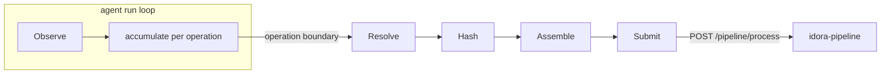

# Recorder - Architecture

This spec defines the internal architecture of the Idora Recorder: the in-CI component that observes `build`/`test`/`deploy` operations, hashes the files they read and wrote, assembles an execution RunRecord, and submits it to the Idora Pipeline service. In the WIT gate model the Recorder is **G1 (Capture)** (see WIT Core [receipt-pipeline](../../wit-core/specs/receipt-pipeline.md) §1); the downstream G2-G4 (Normalize, Receipt Generation, Graph Write) now live in the [idora-pipeline](../../idora-pipeline/specs/architecture.md) service, so the Recorder's sole job is observation and submission. This spec covers the component shape, the internal stage pipeline, the portable-core / CI-adapter split, the deployment model, the crate layout, and the run lifecycle. It does not define the per-stage behavior; that lives in the step specs.

**Status**: Draft

**Codebase mapping**: `ci-tracer/`, `ci-tracer-ebpf/`, `ci-tracer-common/`, `action/`

**Related specs**: [observation](observation.md), [content-hashing](content-hashing.md), [submission](submission.md), [run-record](run-record.md), [ci-adapter](ci-adapter.md), [authentication](authentication.md), [security](security.md), [deployment](deployment.md), [recorder-proposal](../docs/recorder-proposal.md), [idora-pipeline architecture](../../idora-pipeline/specs/architecture.md), [WIT receipt-pipeline](../../wit-core/specs/receipt-pipeline.md)

---

## 1. Component Shape

The Recorder is a privileged agent that runs **inside the customer's CI job**, alongside the build/test/deploy steps it observes. It is the only Idora component that must live in customer CI.

```
        CI job (one runner)
   +-------------------------------+
   |  build / test / deploy procs  |
   |            |  kernel events   |
   |            v                  |          HTTPS
   |        Recorder  -------------------------------> idora-pipeline
   |     (eBPF agent + adapter)    |   POST /pipeline/process
   +-------------------------------+
```

The Recorder is the producer of **execution** RunRecords (`type` in `build` / `test` / `deploy`). Verification and ingestion RunRecords are produced by WIT Core, not here (see [run-record](run-record.md) §1). The Recorder never reads the graph and never writes Neo4j directly; it only submits RunRecords over HTTP.

The agent is **non-invasive**: it attaches to kernel-global hooks and observes the CI processes without wrapping, patching, or replacing them. Removing the Recorder is deleting one CI step (see [deployment](deployment.md)).

---

## 2. What the Agent Does

The Recorder is a **long-running agent**, not a request-handler pipeline. It is started once per CI job and runs in a loop: while the build/test/deploy steps execute, it continuously drains kernel events and accumulates per-operation state; at each operation boundary (and at job end) it finalizes, hashes, assembles, and submits. The responsibilities below are concerns of that one process, not separately deployed stages.

| Responsibility | When it runs | Spec |
|----------------|--------------|------|
| **Observe** | Continuously, draining kernel events (`exec`/`fork`/`exit`/file syscalls) into a per-operation process tree + raw file-access set. | [observation](observation.md) |
| **Resolve** | At operation boundary: absolute paths, operation `type`, `working_directory`, `command`, `exit_code`. | [observation](observation.md) §6, [ci-adapter](ci-adapter.md) |
| **Hash** | At operation boundary (before workspace teardown): `inputs[]`/`outputs[]` `sha256:` content hashes. | [content-hashing](content-hashing.md) |
| **Assemble** | At operation boundary: a complete execution RunRecord + metadata sidecar. | [run-record](run-record.md) |
| **Submit** | After assembly: `POST /pipeline/process`; receipt ID or durable failure. | [submission](submission.md) |



These responsibility boundaries are also the **error/degradation boundaries**: a runner without eBPF produces no record and is reported as unknown coverage (see [deployment](deployment.md) §4, [observation](observation.md) §10); a Submit failure is handled fail-open with reconciliation (see [submission](submission.md) §5).

---

## 3. Portable Core + Thin CI Adapter

The Recorder is split into a **platform-agnostic core** and a **thin CI adapter**, so the same observation/hashing/assembly/submission engine serves GitHub Actions today and GitLab/Jenkins/self-hosted later (see [recorder-proposal](../docs/recorder-proposal.md) §3).

| Layer | Responsibility | Varies per CI? |
|-------|----------------|----------------|
| Core | Observe, Resolve, Hash, Assemble, Submit | No |
| CI adapter | Launch the agent; source `repo`, `commit`, operation labels / `type` hints, deploy target; supply the env allowlist | Yes |

The dividing line is the [ci-adapter](ci-adapter.md) contract: the core depends only on that interface, never on `GITHUB_*` variables directly. Adapter-sourced fields are exactly the ones that differ across CI systems (`repo`, `commit`); process-observed and host-probed fields are identical everywhere (see [run-record](run-record.md) §3).

---

## 4. Deployment Model

The Recorder ships as **Approach A: an external eBPF agent launched by a single CI step** (the recommendation in [recorder-proposal](../docs/recorder-proposal.md) §5). On GitHub Actions this is a composite Action that drops a privileged static binary onto the runner and starts it before the build/test/deploy steps. No customer image change, no entrypoint change.

The non-eBPF fallbacks (Approach C) are an optional fallback delivery vehicle only, for constrained runners. The full delivery contract, runner compatibility matrix, and fallback wiring are in [deployment](deployment.md).

---

## 5. Crate / Module Layout

The Recorder is a Rust workspace using the Aya eBPF toolchain (the PoC layout), plus the CI-adapter and submission code.

```
ci-tracer-ebpf/        -- kernel-side BPF programs (tracepoints/kprobes)
  src/main.rs            attach points + event emission
ci-tracer-common/      -- shared event structs (no_std), used by both sides
  src/lib.rs             ProcessExecEvent, ProcessExitEvent, FileOpenEvent, ...
ci-tracer/             -- userspace agent (the core engine)
  src/main.rs            ringbuf loop, ProcessTree, resolve, hash, assemble, submit
  src/<observe|resolve|hash|assemble|submit>...   stage modules
  src/adapter/           CI-adapter implementations (github, ...)
action/                -- GitHub Action lifecycle (pre/main/post)
  start.js, noop.js, stop.js
```

The kernel/userspace boundary is the `ci-tracer-common` event structs (`ProcessExecEvent`, `ProcessExitEvent`, `FileOpenEvent`). Broadening I/O coverage (see [observation](observation.md) §3) adds event types here and attach points in `ci-tracer-ebpf`, without changing the userspace contract.

---

## 6. Run Lifecycle

On GitHub Actions the lifecycle is bound to the Action's `pre` / `main` / `post` hooks ([action.yml](../action.yml)):

| Phase | Hook | Action |
|-------|------|--------|
| Start | `pre` (`start.js`) | Pull + checksum-verify the binary, mount tracefs/debugfs, start the agent (`sudo`), wait for hooks to attach. |
| Observe | (steps run) | The agent runs in the background while the customer's build/test/deploy steps execute. |
| Flush + submit | `post` (`stop.js`) | Signal the agent to finalize open operations, hash, assemble, and submit; reconcile expected-vs-submitted (see [submission](submission.md) §5). |

Crucially, hashing happens **before** the job tears down (Hash and Assemble run at operation boundaries / at `post`), because file content cannot be recovered after the workspace is gone (see [content-hashing](content-hashing.md) §2).

---

## 7. Concurrency & Performance

| Property | Statement |
|----------|-----------|
| Kernel-global observation | The agent attaches to host-wide hooks and sees every process regardless of its own PID; it does not need to be PID 1 (see [recorder-proposal](../docs/recorder-proposal.md) §5). |
| In-kernel filtering | Hooks pre-filter to the whitelisted process tree where possible to bound event volume (see [observation](observation.md) §4). |
| Bounded overhead | eBPF observation is low-overhead relative to `ptrace` wrapping (see [recorder-proposal](../docs/recorder-proposal.md) Research, Riker). Hashing cost is proportional to the in-scope file set. |
| Single agent per job | One agent instance per runner; operations are segmented in userspace from the process tree (see [observation](observation.md) §5). |

---

## 8. Cross-Repo Dependencies

Some Recorder design goals require changes in idora-pipeline that the Recorder specs reference but do not own:

| Need | Owned by | Referenced in |
|------|----------|---------------|
| Persist the verification-side source hash as an `:Artifact` so the content-hash join can exist | idora-pipeline Graph Write | [content-hashing](content-hashing.md) §6, [run-record](run-record.md) §4 |
| Hash source inputs over **git-blob-normalized content** on the verification side (WIT currently hashes raw checked-out bytes), so both sides match (#1) | wit-core verify | [content-hashing](content-hashing.md) §5 |
| Accept a third `observation_mode` fidelity tier value | idora-pipeline data-types / Graph Write | [content-hashing](content-hashing.md) §4 |
| A deploy-event representation so identical re-deploys are countable | idora-pipeline Graph Write | [run-record](run-record.md) §5 |
| A deploy-target property on execution receipts | idora-pipeline Graph Write | [run-record](run-record.md) §5, [ci-adapter](ci-adapter.md) §5 |

---

## 9. Extensibility

| Extension | How |
|-----------|-----|
| New CI platform | Implement a new [ci-adapter](ci-adapter.md) against the same interface; the core is unchanged. |
| Broader I/O coverage | Add event types in `ci-tracer-common` and attach points in `ci-tracer-ebpf`; Resolve/Hash consume the richer set (see [observation](observation.md) §3). |
| Higher-fidelity hashing | Swap to kernel-atomic hashing on self-hosted runners; the fidelity tier is stamped on the receipt (see [content-hashing](content-hashing.md) §4). |
| Non-eBPF environments | No supported capture today (the outputs-only snapshot fallback is dropped); the runner is reported as unknown coverage. A future input-capable fallback (fanotify) is possible; see [deployment](deployment.md) §4, §6 and [observation](observation.md) §10. |
